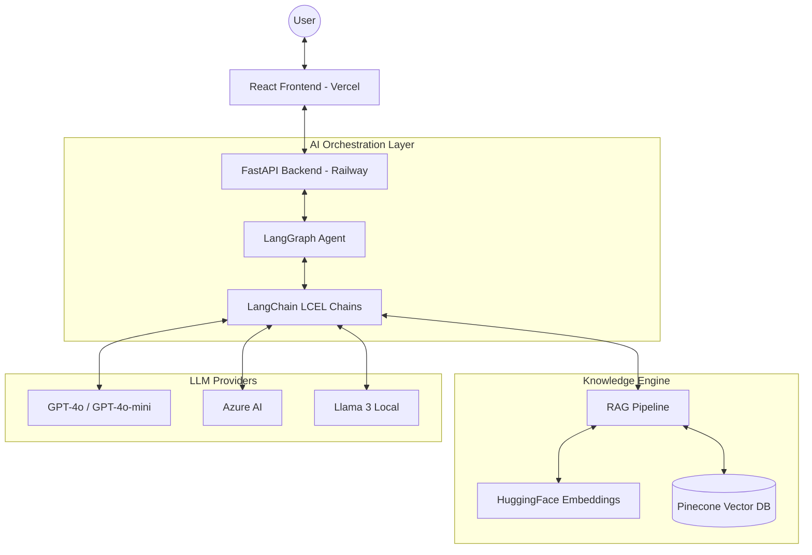

# 🏛️ UnifiedITSM - System Architecture & Technical Deep-Dive

### 🚀 Developed by **GreenAI Team**

This document provides a comprehensive technical overview of the **UnifiedITSM** platform, detailing its architectural components, AI orchestration patterns, and data flow mechanisms.

---

## 1. Project Ecosystem Structure

```
unified-itsm/
├── src/                              # FRONTEND (React 18 + Vite)
│   ├── App.jsx                       # Main Application Shell
│   ├── components/                   # UI Components (Chat, SLA, Dashboard)
│   ├── context/                      # State Management (Language, Theme)
│   ├── index.css                     # Global Styles (Dark Mode, Premium UI)
│   └── main.jsx                      # React Entry Point
│
├── backend/                          # BACKEND (Python FastAPI)
│   ├── main.py                       # FastAPI Application & Router Mapping
│   ├── config.py                     # Environment Configuration (Pydantic)
│   ├── Procfile                      # Deployment Configuration
│   │
│   ├── llm/                          # AI Providers & Chains
│   │   ├── providers.py              # OpenAI / Azure / Ollama Multi-provider logic
│   │   └── chains.py                 # LangChain LCEL Implementation
│   │
│   ├── embeddings/                   # Vectorization Layer
│   │   └── service.py                # HuggingFace (MiniLM-L6-v2) Integration
│   │
│   ├── rag/                          # RAG Strategy
│   │   └── retriever.py              # Semantic Search + Context Augmentation
│   │
│   ├── graph/                        # AI Agent Workflow
│   │   └── workflow.py               # LangGraph StateGraph Orchestration
│   │
│   ├── routers/                      # REST API Endpoints
│   │   ├── auth.py                   # User Authentication & Session Management
│   │   ├── chatbot.py                # Intelligent Chat Assistant (Agentic)
│   │   ├── triage.py                 # RAG-Augmented Incident Classification
│   │   ├── rca.py                    # Root Cause Analysis Logic
│   │   ├── resolution.py             # Resolution Template Generation
│   │   ├── escalation.py             # AI Email Drafting for Escalation
│   │   ├── workflow.py               # End-to-End Workflow Execution
│   │   └── incidents.py              # Pinecone CRUD & Knowledge Base Operations
│   │
│   ├── models/                       # Data Contracts
│   │   └── schemas.py                # Pydantic Request/Response Models
│   └── services/                     # Shared Business Logic
│
├── public/                           # Static Assets (Logos, Icons)
├── vercel.json                       # Frontend Deployment Settings
└── vite.config.js                    # Vite Proxy & Build Settings
```

---

## 2. Technical Technology Mapping

The system is built on a "Best-of-Breed" stack to ensure scalability, intelligence, and a premium user experience.

| Requirement | Technology Choice | Implementation Detail |
| :--- | :--- | :--- |
| **User Interface** | **React 18 + Vite** | Single Page Application (SPA) with real-time state synchronization. |
| **Logic Layer** | **FastAPI** | Asynchronous Python framework for high-performance AI processing. |
| **Intelligence** | **OpenAI GPT-4o** | Primary LLM for reasoning, analysis, and content generation. |
| **AI Orchestration** | **LangChain & LangGraph** | Managing complex agentic states and LCEL chain pipelines. |
| **Vector Memory** | **Pinecone** | High-performance Vector DB for semantic retrieval (RAG). |
| **Text Embedding** | **HuggingFace** | `all-MiniLM-L6-v2` for 384-dimensional dense vector generation. |
| **Local Fallback** | **Ollama (Llama 3)** | On-premise execution option for sensitive PII data. |
| **Voice Interaction** | **MMS-TTS** | Facebook's Massively Multilingual Speech for audio feedback. |

---

## 3. High-Level System Architecture



---

## 4. API Ecosystem

| Method | Endpoint | Description | Core Technology |
| :--- | :--- | :--- | :--- |
| **POST** | `/api/auth/login` | Secure user authentication. | **JWT + Pydantic** |
| **POST** | `/api/chatbot` | Intelligent agentic interaction. | **LangGraph + RAG** |
| **POST** | `/api/triage` | Auto-classify & Priority assignment. | **RAG + Pinecone** |
| **POST** | `/api/rca` | Root Cause Analysis generation. | **LangChain Chain** |
| **POST** | `/api/escalation` | AI-powered email drafting. | **LangChain Chain** |
| **POST** | `/api/workflow` | Full incident lifecycle automation. | **LangGraph StateGraph** |
| **GET** | `/api/incidents/similar` | Semantic search for past incidents. | **Pinecone + HF** |
| **POST** | `/api/incidents/seed` | Populate KB with sample data. | **Pinecone Ops** |

---

## 5. Core Data Flows

### 5.1 RAG-Augmented Triage
1.  **User Input:** User describes the incident (e.g., "CRM slow").
2.  **Vectorization:** HuggingFace converts the text into a 384-dimensional vector.
3.  **Retrieval:** Pinecone performs a cosine similarity search to find the Top-K similar past cases.
4.  **Augmentation:** Triage Prompt is augmented with the retrieved context.
5.  **Inference:** GPT-4o generates a structured JSON (Priority, Category, Team).
6.  **Persistence:** The new incident is stored in Pinecone for future RAG cycles.

### 5.2 LangGraph Agentic Workflow
The system uses a **StateGraph** to manage the incident lifecycle:
- **`classify` node:** Determines if the input requires a quick triage or a full analysis.
- **`triage` node:** Executes RAG-augmented classification.
- **`rca` node:** Analyzes logs and symptoms to suggest root causes.
- **`resolution` node:** Drafts a resolution based on the entire context.

---

## 6. Deployment & Environment

### Deployment Strategy
- **Frontend:** Hosted on **Vercel** with automatic CI/CD.
- **Backend:** Scaled on **Railway** via `Procfile` configuration.
- **Vector DB:** **Pinecone** (Serverless/Starter tier).

### Environment Variables
| Variable | Purpose |
| :--- | :--- |
| `OPENAI_API_KEY` | Access to GPT models. |
| `PINECONE_API_KEY` | Access to Vector DB. |
| `PINECONE_INDEX_NAME` | Target index for RAG. |
| `FRONTEND_URL` | CORS configuration for security. |
| `VITE_API_URL` | Frontend pointer to the backend API. |

---

**UnifiedITSM Architecture** - Researched and developed by **GreenAI Team**

*"Building the future of IT Service Management through Intelligence."*
